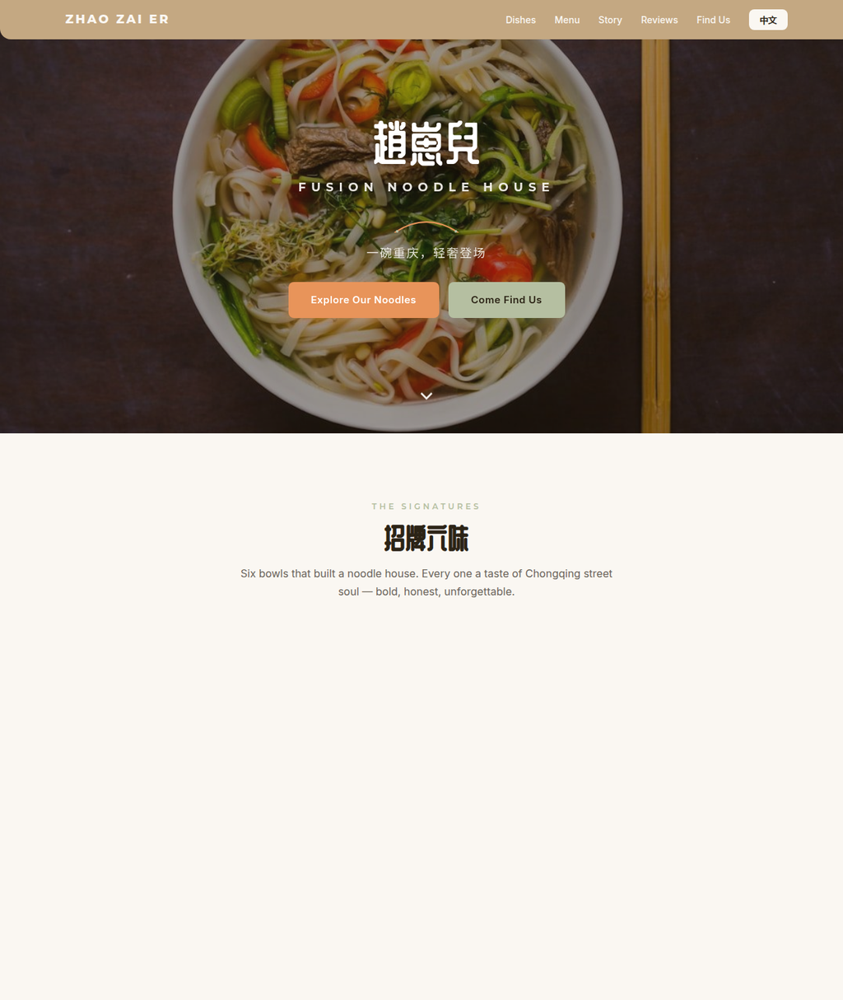

# 趙崽兒 · Zhao Zai Er — Fusion Noodle House

Brand website for **Zhao Zai Er (趙崽兒)**, a modern Chinese fusion noodle house at Macquarie Centre, Sydney — Chongqing street-food roots, contemporary presentation.

**Live:** https://12345666ddwa.github.io/zhaozaier/

## About this build

- Single-file `index.html` — no build step, no dependencies.
- **Bilingual** (English / 中文 toggle).
- Sections: hero, signature dishes (招牌六味), tabbed menu (noodles / rice noodles / sides / drinks), story ("From Chongqing to Sydney"), customer reviews with external rating links, find-us with map, hours and phone.
- Design system in warm terracotta / sage tones matching the restaurant's real interior; fully rounded corners; Montserrat + ZCOOL display type.
- Real storefront & menu photography in `photos/`.

Design & build: Xing Gao — part of a restaurant website portfolio.
